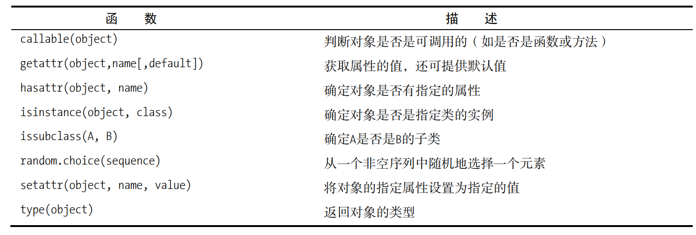

[TOC]

多态：可对不同类型的对象执行相同的操作，而这些操作就像“被施了魔法”一样能够正常运行。

封装：对外部隐藏有关对象工作原理的细节。

继承：可基于通用类创建出专用类。


### 1、类

#### 1.1、类的基础方法

类的基础方法

在Python中，创建构造函数很容易，只需将方法init的名称从普通的init改为魔法版前后带双下划线的init即可。

```python
class Circle(object):
   pi = 3.14  # 类属性

   def __init__(self, r):
       self.r = r  # 实例属性

   def get_area(self):
       """ 圆的面积 """
       # return self.r**2 * Circle.pi # 通过实例修改pi的值对面积无影响，这个pi为类属性的值
       return self.r**2 * self.pi  # 通过实例修改pi的值对面积我们圆的面积就会改变

circle1 = Circle(1)
print(circle1.get_area())  # 调用方法 self不需要传入参数，不要忘记方法后的括号  输出 3.14
```


__这样的方法类似于其他语言中的标准**私有方法**。

现在从外部不能访问__inaccessible，但在类中（如accessible中）依然可以使用它。

```python
class Secretive(object): 
 def __inaccessible(self): 
 		print("Bet you can't see me ...") 
 def accessible(self): 
 		print("The secret message is:") 
 		self.__inaccessible()
```

虽然__开头的方法属于私有方法，但是还是可以从类外进行访问的

```python
>>> s._Secretive__inaccessible() 
Bet you can't see me ...
```

#### 1.2、类的作用域

下面两个方法是等价的

```
def foo(x): return x * x 
foo = lambda x: x * x
```

**类变量和成员变量**

```python
class MemberCounter: 
 members = 0 
 def init(self): 
 		MemberCounter.members += 1 
    
>>> m1 = MemberCounter() 
>>> m1.init() 
>>> MemberCounter.members 
1 
>>> m2 = MemberCounter() 
>>> m2.init() 
>>> MemberCounter.members 
2
```

每个实例都可访问这个类作用域内的变量，就像方法一样。

```python
>>> m1.members 
2 
>>> m2.members 
2
```

#### 1.3 超类

子类扩展了超类的定义。要指定超类，**可在class语句中的类名后加上超类名，并将其用圆括号括起**

Filter是一个过滤序列的通用类。实际上，它不会过滤掉任何东西。

```python
class Filter: 
 def __init__(self): 
 		self.blocked = [] 
 def filter(self, sequence): 
 		return [x for x in sequence if x not in self.blocked] 
 		
class SPAMFilter(Filter): # SPAMFilter是Filter的子类
 def __init__(self): # 重写超类Filter的方法init 
 		self.blocked = ['SPAM']
 		
>>> f = Filter() 
>>> f.filter([1, 2, 3]) 
[1, 2, 3]

Filter类的用途在于可用作其他类（如将'SPAM'从序列中过滤掉的SPAMFilter类）的基类（超类）。
>>> s = SPAMFilter() 
>>> s.filter(['SPAM', 'SPAM', 'SPAM', 'SPAM', 'eggs', 'bacon', 'SPAM']) 
['eggs', 'bacon']
```

请注意SPAMFilter类的定义中有两个要点。

​	1 以提供新定义的方式重写了Filter类中方法init的定义。

​	2直接从Filter类继承了方法filter的定义，因此无需重新编写其定义。

第二点说明了继承很有用的原因：可以创建大量不同的过滤器类，它们都从Filter类派生而来，并且都使用已编写好的方法filter。这就是懒惰的好处。

要确定一个类是否是另一个类的子类，可使用内置方法issubclass。

```python
>>> issubclass(SPAMFilter, Filter) 
True 
>>> issubclass(Filter, SPAMFilter) 
False
```

同样，要确定对象是否是特定类的实例，**可使用isinstance**。

```python
>>> s = SPAMFilter() 

>>> isinstance(s, SPAMFilter) 

True 

>>> isinstance(s, str) 
False
```

**新版的super**

```python
class Bird: 
 def __init__(self): 
 	self.hungry = True
  
 def eat(self): 
 		if self.hungry: 
 			print('Aaaah ...') 
 			self.hungry = False 
 		else: 
    	print('No, thanks!') 
      
class SongBird(Bird): 
	def __init__(self): 
		super().__init__()
    self.sound = 'Squawk!' 
	def sing(self): 
		print(self.sound)
    
>>> sb = SongBird() 
>>> sb.sing() 
Squawk! 
>>> sb.eat() 
Aaaah ... 
>>> sb.eat() 
No, thanks!
```


多个超类（了解）: **多重继承**

```python
class Calculator: 
 def calculate(self, expression): 
 		self.value = eval(expression) 
class Talker: 
 def talk(self): 
 		print('Hi, my value is', self.value) 
class TalkingCalculator(Calculator, Talker): 
 	pass 

子类TalkingCalculator本身无所作为，其所有的行为都是从超类那里继承的。关键是通过从Calculator那里继承calculate，并从Talker那里继承talk，它成了会说话的计算器。
>>> tc = TalkingCalculator() 
>>> tc.calculate('1 + 2 * 3') 
>>> tc.talk() 
Hi, my value is 7
```

检查含有某个属性

```python
>>> hasattr(tc, 'talk') 
True 
>>> hasattr(tc, 'fnord') 
False
```



#### 1.4、函数新方法**property**

​	在这个新版的Rectangle中，通过调用函数property并将存取方法作为参数（获取方法在前，设置方法在后）创建了一个特性，然后将名称size关联到这个特性。这样，你就能以同样的方式对待width、height和size，而无需关心它们是如何实现的。

```python
class Rectangle: 
	def __init__ (self): 
		self.width = 0 
		self.height = 0 
	def set_size(self, size): 
		self.width, self.height = size 
	def get_size(self): 
		return self.width, self.height 
	size = property(get_size, set_size)
	
	
>>> r = Rectangle() 
>>> r.width = 10 
>>> r.height = 5 
>>> r.size 
(10, 5) 
>>> r.size = 150, 100 
>>> r.width 
150
```


#### 1.5、静态方法

```python
class MyClass: 
	@staticmethod 
	def smeth(): 
		print('This is a static method') 
	@classmethod 
	def cmeth(cls): 
		print('This is a class method of', cls)
 
>>> MyClass.smeth() 
This is a static method 
>>> MyClass.cmeth() 
This is a class method of <class '__main__.MyClass'>
```

