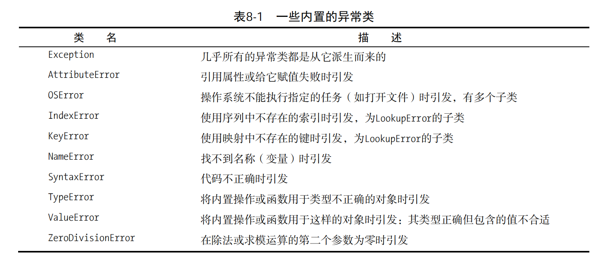

[TOC]

#### 1、**raise** 语句

```python
>>> raise Exception('hyperdrive overload') 
Traceback (most recent call last): 
 File "<stdin>", line 1, in ? 
Exception: hyperdrive overload
```

一些内置的exception



#### 1.2捕获异常

一网打击

```python
try:
  # 代码
except Exception as e:
  print(e)
```


**finally语句:**

不管try子句中发生什么异常，都将执行finally子句。

```python
x = None 
try: 
 x = 1 / 0 
finally: 
 print('Cleaning up ...') 
 del x
```

**else语句：**

除except子句外，你还可使用else子句，它在主try块没有引发异常时执行。

```python
try: 
 1 / 0 
except NameError: 
 print("Unknown variable") 
else: 
 print("That went well!") 
finally: 
 print("Cleaning up.")
```

