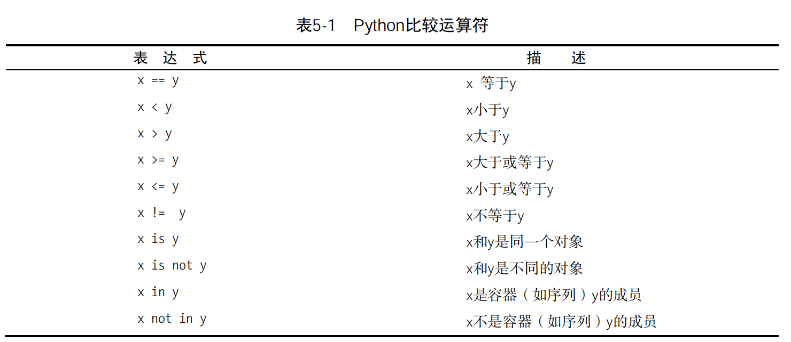
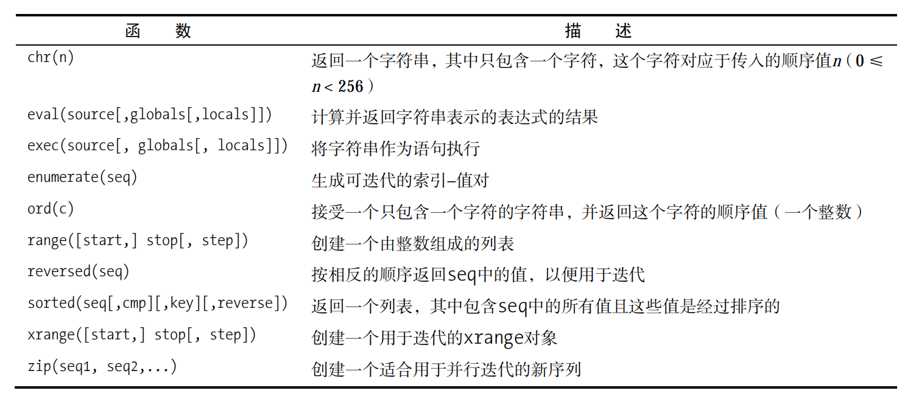

### 1、赋值相关

#### 1.1、序列解包

```python
>>> x, y, z = 1, 2, 3 
>>> print(x, y, z) 
1 2 3

>>> x, y = y, x 
>>> print(x, y, z) 
2 1 3

实际上，这里执行的操作称为序列解包（或可迭代对象解包）：将一个序列（或任何可迭代
对象）解包，并将得到的值存储到一系列变量中。下面用例子进行解释。
>>> values = 1, 2, 3 
>>> values 
(1, 2, 3) 
>>> x, y, z = values 
>>> x 
1
```

#### 1.2、链式赋值

```python
x = y = somefunction() 
上述代码与下面的代码等价：
y = somefunction() 
x = y 
请注意，这两条语句可能与下面的语句不等价：
x = somefunction() 
y = somefunction()
```

#### 1.3、增强赋值

```python
>>> x = 2 
>>> x += 1 
>>> x *= 2 
>>> x 
6
```

### 2、if相关

用作布尔表达式（如用作if语句中的条件）时，下面的值都将被解释器视为假：

False None 0 "" () [] {}

换而言之，标准值False和None、各种类型（包括浮点数、复数等）的数值0、空序列（如空字符串、空元组和空列表）以及空映射（如空字典）都被视为假，而其他各种值都被视为真，包括特殊值True。

#### 2.1、if-else语句

```python
if name.endswith('Gumby'): 
 print('Hello, Mr. Gumby') 
else: 
 print('Hello, stranger')
```

#### 2.2、三目运算

```
status = "friend" if name.endswith("Gumby") else "stranger" 
如果条件（紧跟在if后面）为真，表达式的结果为提供的第一个值（这里为"friend"），否
则为第二个值（这里为"stranger"）。
```

#### 2.3、常用的对比对象



注意：不要将is用于数和字符串等不可变的基本值。鉴于Python在内部处理这些对象的方式，

这样做的结果是不可预测的。

**总之，==用来检查两个对象是否相等，而is用来检查两个对象是否相同（是同一个对象）。**

### 3、for循环

```python
words = ['this', 'is', 'an', 'ex', 'parrot'] 
for word in words: 
 print(word) 
或
numbers = [0, 1, 2, 3, 4, 5, 6, 7, 8, 9] 
for number in numbers: 
 print(number)
```

range

```python
>>> range(0, 10) 
range(0, 10) 
>>> list(range(0, 10)) 
[0, 1, 2, 3, 4, 5, 6, 7, 8, 9] 
范围类似于切片。它们包含起始位置（这里为0），但不包含结束位置（这里为10）。在很多
情况下，你都希望范围的起始位置为0。实际上，如果只提供了一个位置，将把这个位置视为结
束位置，并假定起始位置为0。
>>> range(10) 
range(0, 10) 
下面的程序打印数1～100：
for number in range(1,101): 
 print(number)
```

#### 3.1、迭代字典

要遍历字典的所有关键字，可像遍历序列那样使用普通的for语句。

```python
d = {'x': 1, 'y': 2, 'z': 3} 

for key in d: 

 print(key, 'corresponds to', d[key]) 
```


也可使用keys等字典方法来获取所有的键。如果只对值感兴趣，可使用d.values。你可能还

记得，d.items以元组的方式返回键值对。for循环的优点之一是，可在其中使用序列解包。

```python
for key, value in d.items(): 

 print(key, 'corresponds to', value) 
```

#### 3.2、并行迭代

```
names = ['anne', 'beth', 'george', 'damon'] 
ages = [12, 45, 32, 102] 
如果要打印名字和对应的年龄，可以像下面这样做：
for i in range(len(names)): 
 print(names[i], 'is', ages[i], 'years old')
```

**也可以使用zip**

```
i是用作循环索引的变量的标准名称。一个很有用的并行迭代工具是内置函数zip，它将两个
序列“缝合”起来，并返回一个由元组组成的序列。返回值是一个适合迭代的对象，要查看其内
容，可使用list将其转换为列表。
>>> list(zip(names, ages)) 
[('anne', 12), ('beth', 45), ('george', 32), ('damon', 102)]
“缝合”后，可在循环中将元组解包。
for name, age in zip(names, ages): 
 print(name, 'is', age, 'years old')
```


本章函数

