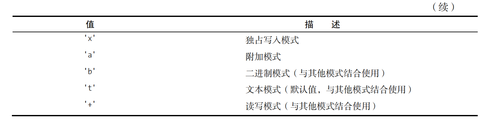

[TOC]

### 1、open

#### 1.1、model参数




​		显式地指定读取模式的效果与根本不指定模式相同。写入模式让你能够写入文件，并在文件

不存在时创建它。独占写入模式更进一步，在文件已存在时引发FileExistsError异常。在写入模

式下打开文件时，既有内容将被删除（截断），并从文件开头处开始写入；如果要在既有文件末

尾继续写入，可使用附加模式。

​		+'可与其他任何模式结合起来使用，表示既可读取也可写入。例如，要打开一个文本文件进行读写，可使用'r+'。（你可能还想结合使用seek，详情请参阅本章后面的旁注“随机存取”。）

**请注意，'r+'和'w+'之间有个重要差别：后者截断文件，而前者不会这样做。**

### 2、读写

#### 2.1、简单的读写

```python
>>> f = open('somefile.txt', 'w') 
>>> f.write('Hello, ') 
7 
>>> f.write('World!') 
6 
>>> f.close()

>>> f = open('somefile.txt', 'r') 
>>> f.read(4) 
'Hell' 
>>> f.read() 
'o, World!'
```


#### 2.2、使用管道重定向输出

$ cat somefile.txt | python somescript.py | sort 

```python
# somescript.py 
import sys 
text = sys.stdin.read() 
words = text.split() 
wordcount = len(words) 
print('Wordcount:', wordcount)

somefile.txt
Your mother was a hamster and your 
father smelled of elderberries. 

cat somefile.txt | python somescript.py的结果如下：

Wordcount: 11
```

#### 2.3、关闭文件

 别忘了调用方法close将文件关闭。通常，程序退出时将自动关闭文件对象（也可能在退出程序前这样做），因此是否将读取的文件关闭并不那么重要。

对于写入过的文件，一定要将其关闭，因为Python可能缓冲你写入的数据（将数据暂时存储在某个地方，以提高效率）。因此如果程序因某种原因崩溃，数据可能根本不会写入到文件中。

```python
# 在这里打开文件
try: 
 # 将数据写入到文件中
finally: 
 file.close()
实际上，有一条专门为此设计的语句，那就是with语句。
with open("somefile.txt") as somefile: 
 do_something(somefile)
```

with语句让你能够打开文件并将其赋给一个变量（这里是somefile）。在语句体中，你将数据写入文件（还可能做其他事情）。到达该语句末尾时，将自动关闭文件，即便出现异常亦如此


#### 2.4、读一个字节

```python
with open(filename) as f: 
	while True:
		char = f.read(1) 
 		if not char: break 
 		process(char)
```


#### 2.5、读一行数据

```python
with open(filename) as f: 
	while True: 
		line = f.readline() 
 		if not line: break 
 		process(line)
```


#### 2.6、读取所有内容

如果文件不太大，可一次读取整个文件；为此，可使用方法read并不提供任何参数（将整个文件读取到一个字符串中），也可使用方法readlines（将文件读取到一个字符串列表中，其中每个字符串都是一行）

```python
with open(filename) as f: 
 for char in f.read(): 
 	process(char)
 
with open(filename) as f: 
 for line in f.readlines(): 
 	process(line)
```


#### 2.7、大文件读取

  有时候需要迭代大型文件中的行，此时使用readlines将占用太多内存。当然，你可转而结合使用while循环和readline，但在Python中，在可能的情况下，应首选for循环，而这里就属于这种情况。你可使用一种名为延迟行迭代的方法——说它延迟是因为它只读取实际需要的文本部分。

```python
import fileinput 
for line in fileinput.input(filename): 
 process(line)
```


#### 2.8、可以直接迭代

我们也可以直接迭代文件

```python
for line in open(filename): 
 process(line)
```


可以使用print写文件

```python
>>> f = open('somefile.txt', 'w') 
>>> print('First', 'line', file=f) 
>>> print('Second', 'line', file=f) 
>>> print('Third', 'and final', 'line', file=f) 
>>> f.close() 
>>> lines = list(open('somefile.txt')) 
>>> lines 
['First line\n', 'Second line\n', 'Third and final line\n'] 
>>> first, second, third = open('somefile.txt') 
>>> first
```


