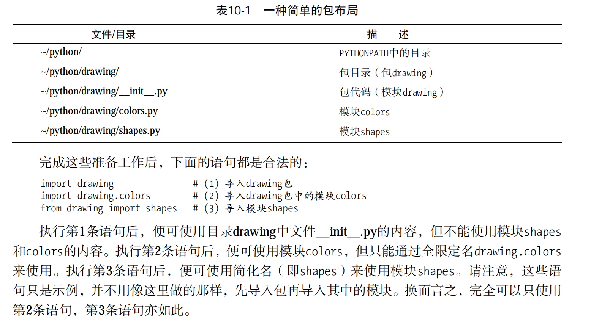
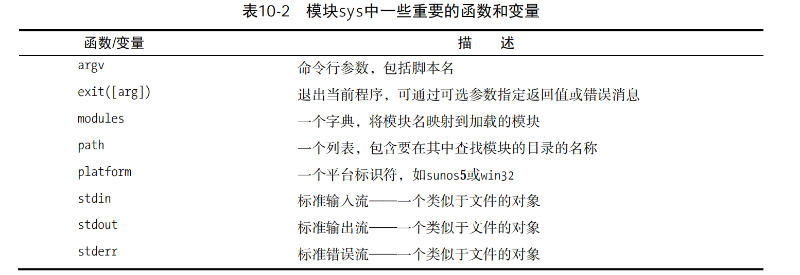
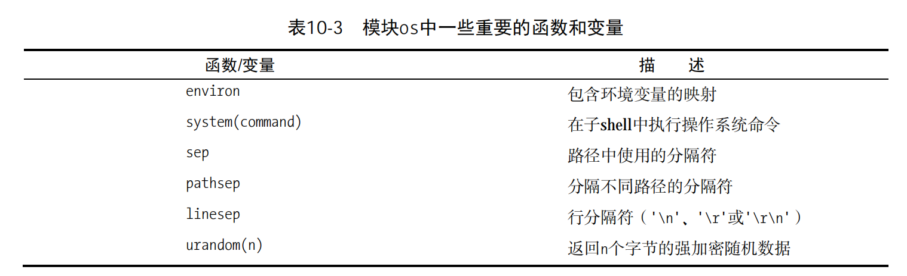
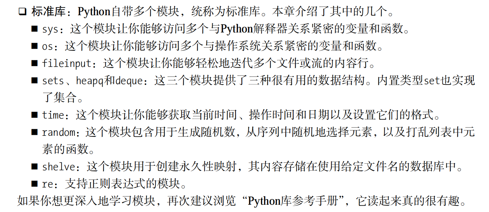

---

---

[TOC]

### 1、模块导入

```python
# hello4.py 
def hello(): 
 print("Hello, world!") 
def test(): 
 hello() 
if __name__ == '__main__': test()
  
  
>>> import hello4 
>>> hello4.hello() 
Hello, world!

如你所见，我将测试代码放在了函数test中。原本可以将这些代码直接放在if语句中，但通
过将其放在一个独立的测试函数中，可在程序中导入模块并对其进行测试。
>>> hello4.test() 
Hello, world!
```

### 2、包

​	为组织模块，可将其编组为包（package）。包其实就是另一种模块，但有趣的是它们可包含其他模块。模块存储在扩展名为.py的文件中，而包则是一个目录。要被Python视为包，目录必须包含文件`__init__`.py。如果像普通模块一样导入包，文件__init__.py的内容就将是包的内容。例如，如果有一个名为constants的包，而文件constants/`__init__`.py包含语句PI = 3.14，就可以像下面这样做：

```python
import constants 

print(constants.PI) 
```



### 3、标准库

#### 3.1、sys



#### 3.2、os



```
if not os.path.exists("文件路径"):
   # os.mkdir(day + '/')
   # os.system('touch ' + day + '/')
```

#### 3.3、集合、堆和双端队列

​	set() 函数是python内置函数的其中一个，属于比较基础的函数。创建一个无序不重复元素集，可进行关系测试，删除重复数据，还可以计算交集、差集、并集等。

```python
>>>x = set('runoob')
>>>y = set('google')
>>> x, y
(set(['b', 'r', 'u', 'o', 'n']), set(['e', 'o', 'g', 'l']))   # 重复的被删除
>>> x & y         # 交集
set(['o'])
>>> x | y         # 并集
set(['b', 'e', 'g', 'l', 'o', 'n', 'r', 'u'])
>>> x - y         # 差集
set(['r', 'b', 'u', 'n'])
```


```python
list1=[1,2,3,4]
s=set(list1)
print(s)
#逐个遍历
for i in s:
  print(i)
 
输出:
set([1, 2, 3, 4])
1
2
3
4

list1=[1,2,3,4]
s=set(list1)
print(s)
s.add(4)
s.add(5)
print(s)
 
输出：
set([1, 2, 3, 4])
set([1, 2, 3, 4, 5])

list1=['a','b','zhang','kang']
s=set(list1)
print(s)
s.remove('zhang')
print(s)
 
输出：
set(['a', 'kang', 'b', 'zhang'])
set(['a', 'kang', 'b'])
```

标准库

